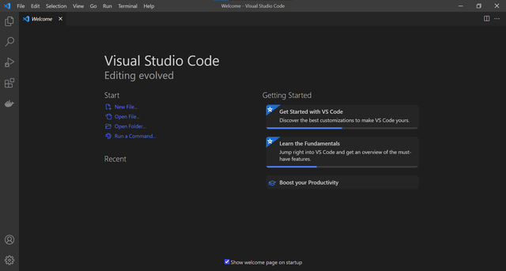
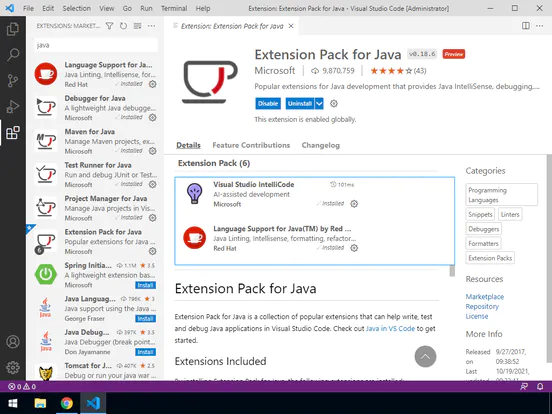
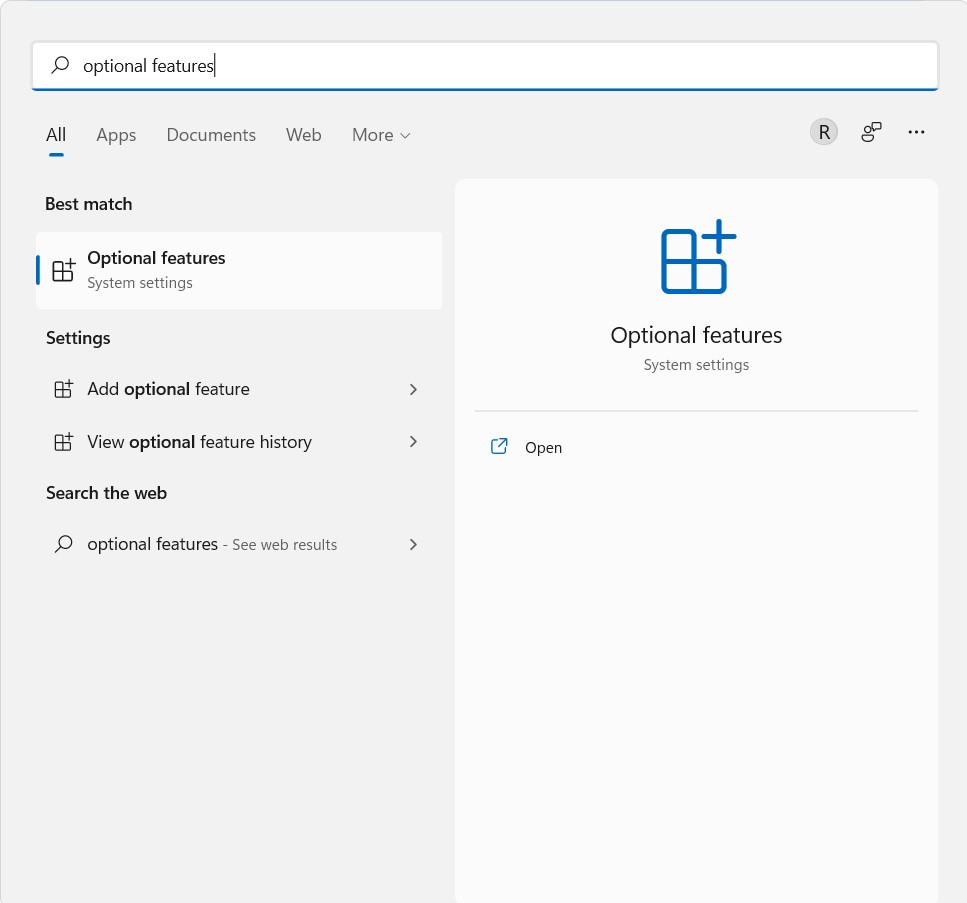
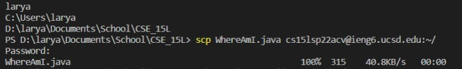
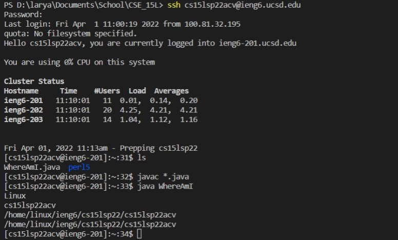
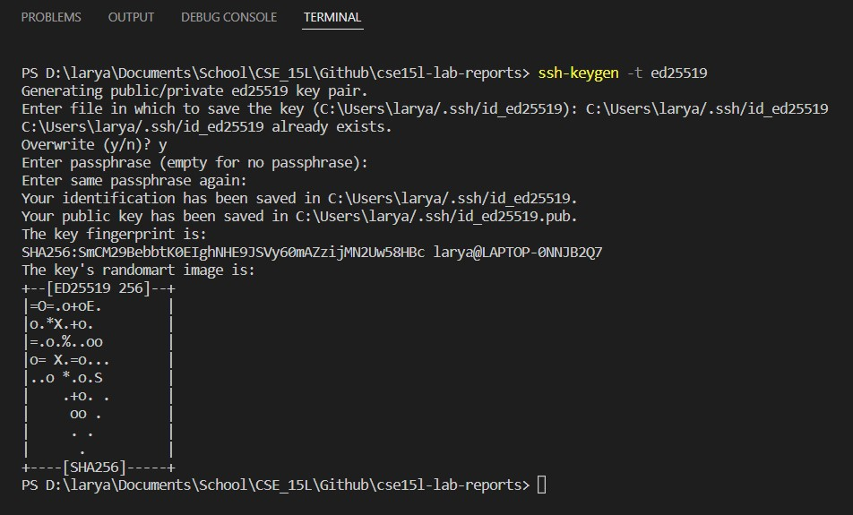

# How to Remote Access 101

Hey there, CSE 15L Student

So you want to learn how to log in to your course-specific account on ieng6 on the UCSD CSE server...  
Well then, I'm here to tell you that it'll be an arduous endeavor, a Herculean task, Odysseus' Iliad.  
However, if you still want to proceed... then go ahead and learn to your heart's content. It comes with many perils. **But**, learning this skill will prove to be beneficial in the coming future of your career.

## 1. Visual Studio Code
First of all, you'll have to download [Visual Studio Code](https://code.visualstudio.com/). VS Code is a source-code editor that you can use to code programs, edit files, etc.  
[Here](https://code.visualstudio.com/docs/introvideos/basics) is a tutorial on the basics of using VS Code.  
If it's already installed, and you're familiar with its functions, you can skip to step 2.  
Go to [this website](https://code.visualstudio.com/)
and follow the steps to installing it.  
Once it's installed, and opened, you should see something like this (after you've chosen your theme).

>

We will be using the programming language **Java** throughout this course, so we will need to install it onto Visual Studio Code

>
>1. On the vertical tab bar on the left, locate and click on the **Extensions** tab
>2. Find or search for the **Extension Pack for Java** and install it

The extension pack allows Visual Studio Code to run Java files and includes recommended software that assists you as you run and test your own Java code. 

Additionally, you will have to install the Java Development Kit to run Java within Visual Studio Code and your computer. A Java Development Kit (JDK) is a software used for developing Java applications. 
1. Go to this [website](https://www.oracle.com/java/technologies/downloads/#jdk18-windows)
2. Find the right installer for your computer
3. Install it

## 2. Secure Socket Shell Protocol (SSH)
Congratulations, you've passed the first step. You should be proud of yourself.  
Now that you know how to open the terminal, there's actually one other step you need to do.

You have to install OpenSSH onto your computer.
>
>1. I found it easiest to go to your windows search and type in optional features like so
>2. Select it, then click on `Add an optional feature`
>3. Install **OpenSSH Server**
>4. Install **OpenSSH Client**

If this doesn't work, consult the [official Microsoft website](https://docs.microsoft.com/en-us/windows-server/administration/openssh/openssh_install_firstuse).


## 3. Ok now you can SSH
First, you have to find your course-specific account to log onto `ieng6` using the [UCSD Account lookup](https://sdacs.ucsd.edu/~icc/index.php) and follow the steps towards resetting your password and activating your cse account.

Once that's done, you can go back to your Visual Studio Code.
* Up on the taskbar where it has File, Edit, ..., click on where it says Terminal
* There should be a dropdown menu with the option `New Terminal`, or use the shortcut ```(Ctrl+Shift+`) ```
* Type in `ssh <account>@ieng6.uscd.edu` (where `<account>` is replaced by your account username)

You should see something similar to this


> For security measures, you will not be able to see your password as you type it out, but it is there.  
> It will log you on to whichever computer is most free (least traffic)

## 4. Test out some commands
Now that you've logged onto the server, try out some commands. Get used to how the terminal works. See how they function both on your computer and the remote computer you `ssh` into. [Here](https://www.hostinger.com/tutorials/linux-commands) are some basic commands that you can try on the terminal.

Remember that the remote computer you log onto uses a UNIX based operating system, so to separate directories, use `/`  
When using Windows, the directory separator is `\`.   
>(Mac is also a UNIX based operating system).

When you want to log out of the remote computer, use:
* Ctrl-D
* Use the command `exit`

You can open multiple terminals through the terminal tab on the top with `Split Terminal`  
`New Terminal` can also be used to reset/clear the terminal

## 5. Moving Files over SSH through SCP
Great, you've logged onto a remote computer using SSH, and you know how to run several commands on the terminal to affect/move around files. Now, the question is how do you copy files from your computer to the remote computer. You've already seen some applications that enable you to do this, such as sending files to yourself over Discord, through Google Drive, etc. However, you'd need physical access to both computers. Being able to transfer files back and forth remotely between computers is key to a lot of computer science careers.

The command to copy a file (or many files) from your computer to a remote one is `scp`. It is run from the *client*, meaning from your computer. So, in order to copy a file, you need to first find/make the file you want to transfer over. First, choose a file.

>If you don't have any files to use, here's a simple one you can make on Visual Studio Code  
>Make a new file, select **Java** as the language, and add the following code
>```
>class WhereAmI {
>    public static void main(String[] args) {
>        System.out.println(System.getProperty("os.name"));
>        System.out.println(System.getProperty("user.name"));
>        System.out.println(System.getProperty("user.home"));
>        System.out.println(System.getProperty("user.dir"));
>    }
>}
>```
>Save this file as a .java file onto your computer and name it **WhereAmI.java**  
>You can run it on your terminal
>1. cd into the directory where you saved **WhereAmI.java**
>2. Run `javac WhereAmI.java` on your terminal to compile the file. If you check the directory, you will see that a new file, **WhereAmI.class** has been created
>3. Run `java WhereAmI` to execute the program

Now that you have a file, enter its directory and run  
`scp <file_name> <your_username>@ieng6.ucsd.edu:~/`  
* `<file_name>` is replaced with the name of the file, including what comes after the .
* `<your_username>` is the username you used to ssh into the remote computer

Example:
>
> Once it reaches 100% on the right, that means that the file has completely and successfully transferred over.  
> 315 is the size in bytes of the file  
> 40.8 KB/s is the speed of transfer  
> 00:00 is the number of seconds it took to copy over the file

Now, it's still important to make sure that the file has indeed copied over to the remote computer. So, `ssh` into the remote computer again, and use `ls` to list the files.



You can see that there is another file, meaning that WhereAmI.java has indeed copied over. Just like on your computer, you can even copmile and run it on the remote computer to see how it works.

## 6. Setting up an SSH-Key
Congratulations, you've successfully learned how to not only log onto a remote computer through `ssh`, but also copy files over from your computer through `scp`. However, don't you think having to enter your password multiple times feels inefficient? What if I told you that you could connect your computer to your account on the remote computer without a password.

Enter, `ssh-keygen`. The idea behind generating ssh-keys is to create a pair of keys, a public key, which is stored on the server and a private key, which is only accessible on the client (your computer). That way, when you `ssh` into the server, it'll compare the two keys instead of a password.

To create the keys,
1. Make sure you're on the client
2. Run `ssh-keygen -t ed25519`  
3. When asked to enter a file, enter the directory in the parenthesis
4. When asked for a passphrase, make sure you don't enter anything. Just press `enter`
5. Press `enter` again for the same passphrase
6. Profit

Your terminal should look something like this.

Because I already had a key, it asked me to overwrite it. Typically, you wouldn't get that message.

You can go into your file explorer and check the .ssh directory you saved the ssh-keys in and see that there is an id_ed25519 file and a id_ed25519.pub file. The `.pub` is the public file that you're going to `scp` over to the server. In order to do that, then in the terminal:

1. ssh into your account on the server
2. Create the .ssh directory using `mkdir .ssh`
3. Logout of the server
4. Once you're on the client,  
`scp /Users/<username>/.ssh/id_ed25519.pub <username>@ieng6.ucsd.edu:~/.ssh/authorized_keys`
    * The first `<username>`is your username on your computer to access the file. It is the file path to the public key.
    * The second `<username>` is your course-specific username when you log onto the server

Now, try to ssh onto the server again. If done correctly, you'll see that you don't need to enter a password anymore.

## 7. Optimizations
Generating ssh keys is just one part of optimizing your remote runtime. There are several ways to try to run commands on the server more efficiently, such as combining commands

* You can add a command in quotes `" "` to directly run it on the server and exit. For example, the following command will log in to the server, list the home directory on the server, and log out of the server in one line.
    * `ssh cs15lsp22abc@ieng6.ucsd.edu "ls"`
* You can also add semicolons to signify the end of a line in order to combine several commands into one line. For example, the following command will create a copy of a file, compile it, and run it all in one line.
    * `cp WhereAmI.java OtherMain.java; javac OtherMain.java; java OtherMain`

There are multiple methods as well to limit the amount of keystrokes used.
* In the middle of a file name, pressing `TAB` will autocomplete the rest of the name as long as there is enough of the name to work off of.

Try to find the most efficient way to edit and run files, scp files, etc. in order to save the most amount of time, keystrokes, and mouse clicks.

## 8. Conclusion
Well, you've done it. You've learned the basics of remote running on terminal. However, this is not the end of your journey; it is only the beginning. There are much more advanced commands and techniques you can learn for your future development.