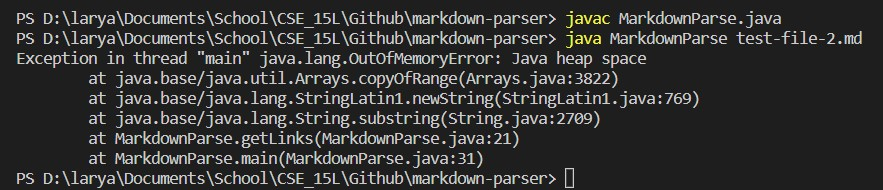
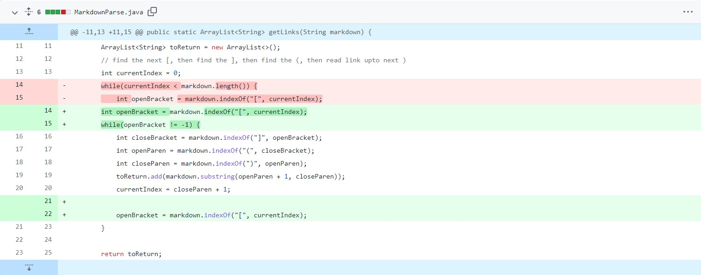
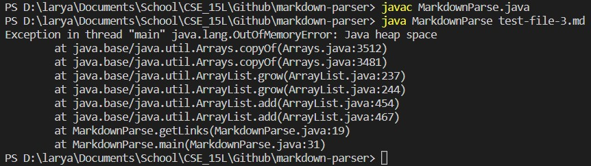
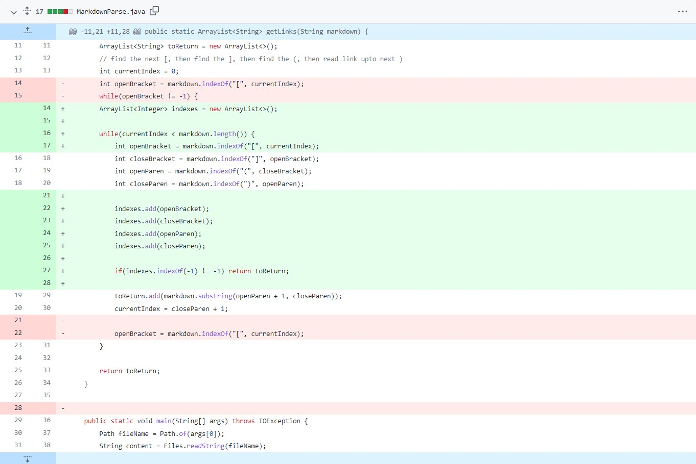
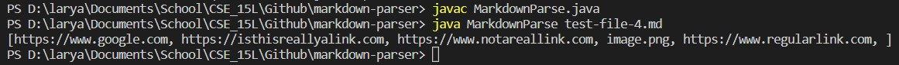
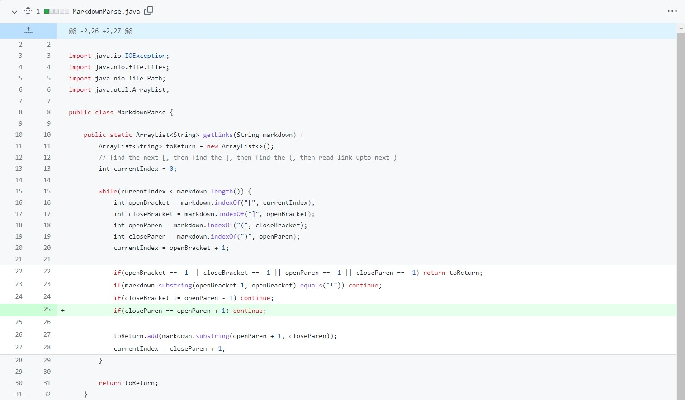

# Code Changes

Starting off right after I forked the MarkdownParser repository and took a look at the code, I realized something that would cause an error: not every markdown file would end in a link, as shown by this [test case here](https://ry-la.github.io/markdown-parser/test-file-2.html). If run, it would produce an infinite loop, as shown by the following output.

This change sought to fix that as instead of ending the loop at markdown length, it checks to see if there are any more opening brackets for it to stop, which worked for that case.

---

However, it didn't take long for there to be another error, which was caused by other brackets or parenthesis not being present. As shown by the following text, [this test case](https://ry-la.github.io/markdown-parser/test-file-3.html) also caused infinite loops because there are no parentheses, so I knew that the first change would not work. 

Thus, I created an arraylist to store indexes to check if there were any missing brackets or parenthesis to signal that there were no more links.

---

Lastly, after facing more errors from other test cases, including [this test case](https://ry-la.github.io/markdown-parser/test-file-4.html), I realized how inefficient that code was and decided to use regular if statements instead.

As shown above, it took in improperly formatted links (fake links), images, and that little space right before the end bracket shows that it also takes in formatted text without a link, so I accounted for those exceptions in the following code.

The if statements are a lot easier to understand and are more efficient for runtime, so in the end, the code became much more optimal.