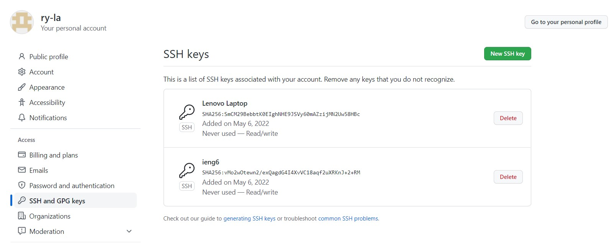
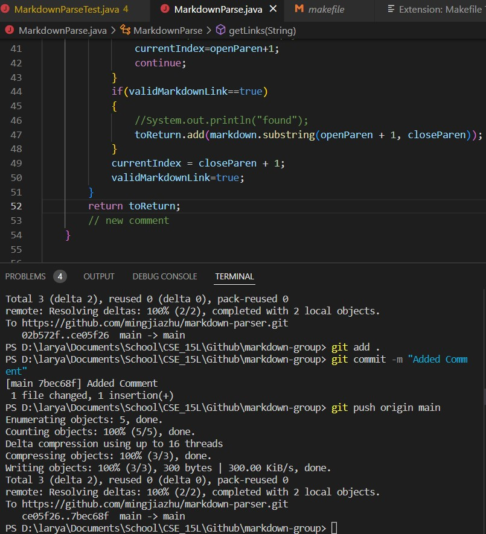

# Lab Report 3

## Streamlining ssh Configuration

In order to streamline ssh, we created a file called config in our .ssh folder as seen in the highlighted blue box, and I edited its contents through VScode Studio.

The alias goes after `Host`, and I chose was `ieng6`, which is used in the terminal to ssh into the server as shown through the orange underline. Then, after `Username` goes the server that is usually after the `@` sign. In this case, the purple underline shows that the server we're logging into is `ieng6.ucsd.edu`. Lastly, after the `User` is your course-specific account you log into. My account is `cs15lsp22acv`, and as the green underline reveals, `ssh ieng6` correctly logs me into the right account.

You can also scp using this streamlined method. Instead of having to use `scp [File name] cs15lsp22acv@ieng6.ucsd.edu:~/`, you could just use `scp [File name] ieng6:~/`, or whatever name you chose for the host alias. To be sure it works, you can also you can compile and run it on your remote account, which worked properly.

## Setup Github Access from ieng6

Setting up a Github SSH Key is vital to making Github changes straight from your terminal, and therefore, from your remote server. The public key is stored in Github in the `SSH and GPG Keys` in your profile settings as shown.

The private key on my course-specific user account is stored in its .ssh folder as shown here.

Thus, when making an edit and pushing a change to Github, we'd use these lines.

I added an unnecessary comment just to showcase how using git from the terminal works. As you can see, `git push origin main` did not require a password because it was able to check our keys that we added to github and see that the computer was authorized. [Here](https://github.com/mingjiazhu/markdown-parser/commit/7bec68f9e05399c3fe6ef4633e44b176d2d4fcbc) is the commit history that showed this change.

## Copy whole directories

When using `scp`, you can actually copy a whole directory over to the remote server vs. copying only one file by using `scp -r .`, where `-r` tells `scp` to recursively copy and `.` is the source and current directory.

So, let's `ssh` into our account and check to see that it is actually there.

(Because my disk space is full, it wasn't able to transfer over the lib folder; thus, I am unable to run the files and test it. However, it worked on Friday.)