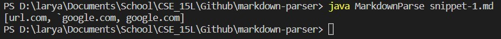

This lab report shows the results of running different versions of MarkdownParse on three different snippets.

The first MarkdownParse code was written by me, accessed [here](https://github.com/ry-la/markdown-parser)

The next MarkdownParse code was written by Hiro, whose code we reviewed in week 7, accessed [here](https://github.com/Hiro-229/markdown-parser).
More specifically, the code we reviewed in week 7 is [this specific commit](https://github.com/Hiro-229/markdown-parser/commit/f1ee54801dffa5878867917e0b438cbf5b07f287)

Through the use of the CommonMark demo site, which lets us see previews of markdown files, we know which lines count as valid links for us to read and add to the arraylist of links.

## Snippet 1


Here, we see that the last 3 links are valid links in markdown, and the first link is not. Therefore, the expected output should be [`google.com, google.com, ucsd.edu].



However, based on my version of MarkdownParse, it only takes in the first 3 links instead and ignores the last link. My code checks solely for links formatted like [ ]( ), which is why when there is a nested ending square bracket without an opening parenthesis immediately afetr it, it moves on. Interestingly, the backticks don't seem to affect the url itself, but the link in the square brackets. Thus, to fix it, I could check what's inside the square brackets to see if there are two backticks. If there are two backticks, I could ignore what is inside of it to keep the validation of the link. This fix should be small because it should just introduce a new character check for a backtick, and if there is another backtick on the same line, to continue searching for square brackets.


Much like mine, the code we reviewed on week 7 also included the first 3 links. On the other hand, it also included the last link, which mine didn't get. This is because they checked if there is an open bracket after the link, and if there isn't, then include everything after the latest checked "(" as a link.

## Snippet 2


In snippet 2, there are multiple valid links with the first line only including the nested link. And, as you can see from the bottom left corner, the nested parenthesized url should include all of the nested parentheses. So, the expected output should be [a.com, a.com(()), example.com].


Surprisingly, I received an index out of bounds exception, and I realized that it was because I was checking every link to see if there was an ! before every [ to exclude images. Meaning, I didn't account for when the first character was an opening square bracket, and it tried to check if the character at index -1 was an exclamation point. 


Once I fixed it, my results showed only [a.com, a.com((], which made sense because I ended the link once it sees one ending parenthesis. There is a solution, but it would not be that short because I would to implement a counter that increments for every open bracket/parenthesis and decrement for every ending bracket/parenthesis. To do that, I would have to implement a while loop that checks if the counter is 0 or until the current character indicates the end of the line "\n". If the character is open, add one to the counter, else if the character is ending, subtract one. This much is short enough, however, to account for the nested link, I would need to create a break statement checking if there is a proper formatted link nested somewhere inside that while loop, and if there is, I can reset the counter and continue with getLinks. This condition may take a decent number of lines.


Much like my own function, when testing snippet 2 on the code we reviewed on week 7, there is an index out of bounds error. This is due to the same problem that they've checked if the character before openBracket is an "!", but they fail to account for if openBracket == 0. Therefore, they are asking the system to check the character at index -1, which is out of bounds.

## Snippet 3


Lastly, in snippet 3, we see that only ```[this title is really long and takes up more than 
one line](
https://sites.google.com/eng.ucsd.edu/cse-15l-spring-2022/schedule
)```
should count as a link. So, the expected output should be [https://sites.google.com/eng.ucsd.edu/cse-15l-spring-2022/schedule].


Originally, running snippet 3 on my markdown parser threw an index out of bounds exception due to the same reasons as snippet 2.


However, after, the fix, it included everything that is between an open and closing parenthesis, including an entire formatted link and all the space in between. The solution to this problem should be simple enough. If there are any consecutive new lines "\n" between the square brackets or the parenthesis, then the substring does not count as a link. All the text in the link that works are on consecutive lines, which markdown accounts for as one line, so it works. The other's have multiple new lines in between texts, so they do not work. Additionally, the url should be trimmed.


Much like with mine, it has the same errors as snippet 2, so it throws an IndexOutOfBounds Exception.