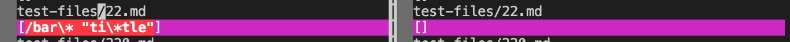
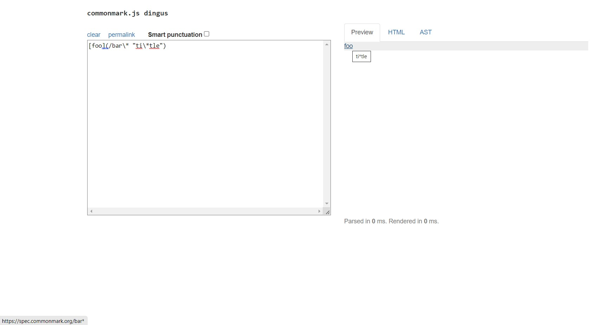
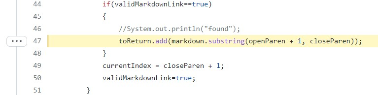
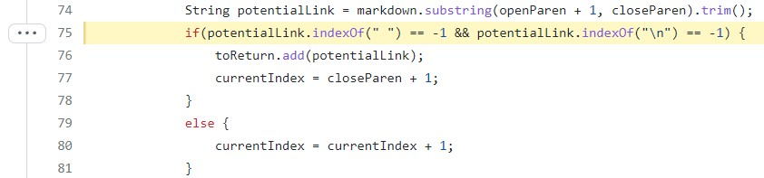
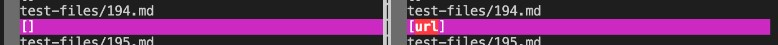
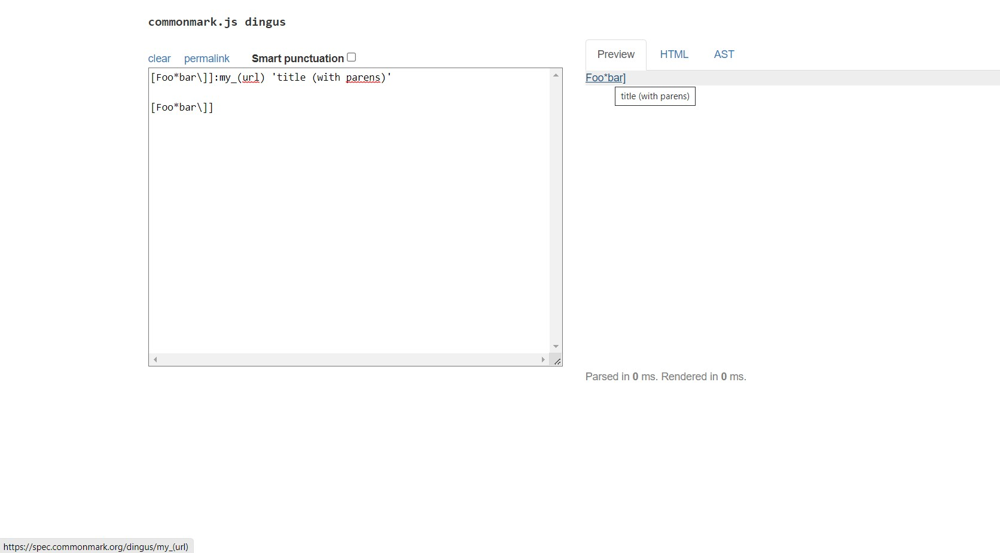
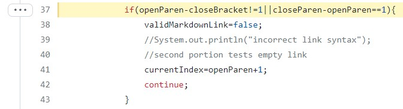
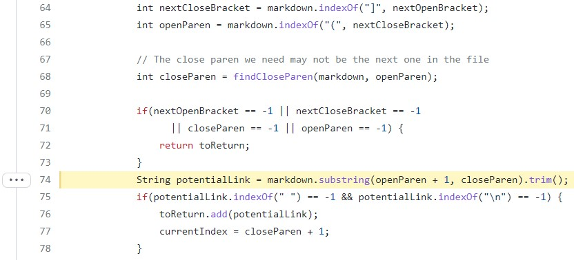

MarkdownParser is a program that we have coded in order to get all the links from a markdown file and output them into one arraylist. During Lab 9, we compared two the results of many tests between two different markdown parsers by outputting the run onto a results text file and comparing the two using `vimdiff`. We then scrolled through it and documented any differences that were highlighted.

Two of the tests that were different when reviewing vimdiff results were [Test-File 22](https://github.com/nidhidhamnani/markdown-parser/blob/main/test-files/22.md) and [Test-File 194](https://github.com/nidhidhamnani/markdown-parser/blob/main/test-files/194.md).

## Test 22

For test 22, our markdown parser noted a link, which was `/bar\* "ti\*tle"`, while the given markdown parser found no links at all as shown in the image below. The results from the markdown parser we wrote is on the left, while the given markdown parser's output is on the right.

We found out that both implementations were  wrong. Through the use of CommonMark Demo, which lets us see the preview of what a markdown file would look like, we see that the url itself is actually just `bar*` from the link indicated in the bottom left corner of the page. 

The purpose of `"ti\*tle` was just to reveal to the user the title of the link, "ti\*tle" when it is hovered over. Therefore, we can conclude that only `bar*` should be produced from the file.

The code above comes from the markdown parser we wrote. The bug lies in line 47 as once it finds that there is a properly formatted link, it takes in everything that is in between the parenthesis. However, now we understand that if there are quotation marks inside the link, then that indicates the title, and we should ignore it.

The reason for the other markdown parser's error lies in line 75, which checks to see if there is a space or new line in the potential url. In most cases, a space in the url would break a link's validity; however, that does not appear to be the case for spaces followed by a quotation mark. Thus, the other markdown parser must check to see if the space is followed by a quotation mark to know if a link is valid or not and to get what comes before it.

## Test 194

In test 194, the opposite occurred. This time, our markdown parser found nothing, but the other markdown parser from the given repository found `url`.

Once again, we used Commonmark to check the expected output, and we realized that there is a proper link. However, when we hover over the blue text, the link at the bottom left corner showed `my_(url)`, and the title of the link was "title (with parens)". 

Thus, both implementations of markdown parser were once again wrong. Instead of getting the whole `my_(url)` url, the other markdown parser only took in `url` and left out the `my_()`.

For test file 194, the reason for our markdown parser failing to notice any links was due to line 37, which checks to see if the opening parenthesis comes right after the closing bracket to consider the link to be valid. We thought that all links came in the form ``, so we failed to account for other forms of links. Thus, we need to implement another case that checks for `[ ]:` to get links only if there is another `[ ]` with the same contents. Otherwise, the text formatted in the `[ ]:` would not appear on screen.

While the other markdown parser managed to find a link, it wasn't unable to get the whole thing. The reason for that lies in line 74, which determines what to add as the valid url. In their code, once they find a valid link, they add only the text inside the parenthesis. Therefore, the parenthesis and the parts of the link outside it were never considered.

Overall, we determined that there were many types of formatting and exceptions when it comes to producing a link in markdown. Writing a program to get all the links was not as simple as first believed due to all of the possible cases to consider. Thus, incremental development and proper usage of software tools such as jdb and vim are essential to helping us code in big projects and advancing our future careers.

